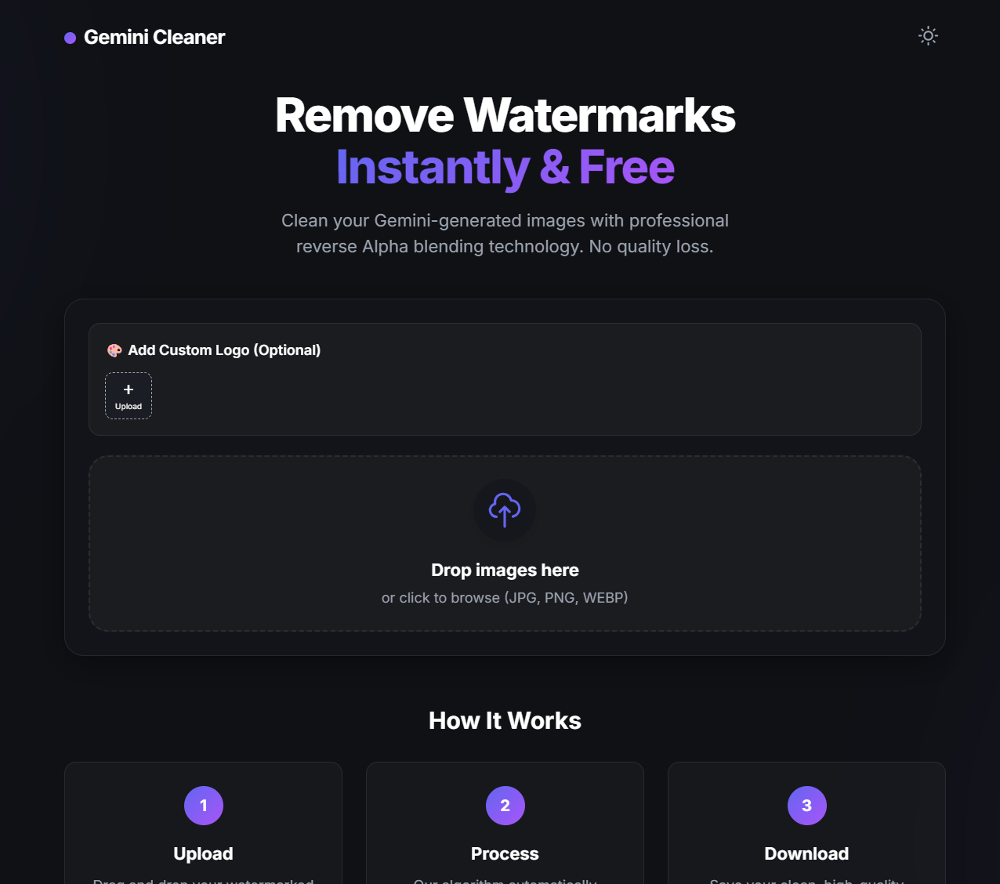

# Gemini Watermark Remover 🎨

A professional, privacy-focused web tool designed to remove visible watermarks from Google Gemini-generated images using reverse Alpha blending technology. Runs entirely in your browser.



## ✨ Features

- **🚫 AI Watermark Removal**: Automatically detects and cleans Gemini watermarks without quality loss.
- **🔒 Privacy First**: All processing happens locally (Client-Side). No images are uploaded to any server.
- **🌓 Dark & Light Mode**: Auto-detects system preference with a manual toggle switch.
- **🖼️ Batch Processing**: Drag and drop multiple images at once.
- **🎨 Custom Branding**: Overlay your own logo, adjust opacity, and resize.
- **📱 Responsive Design**: Works seamlessly on Desktop and Mobile devices.

## 📂 Project Structure

This project follows a professional directory structure to keep files organized.

```text
GeminiWatermarkRemove/
│
├── .vscode/               # VS Code Configuration
│   └── settings.json      # Live Server settings to set root to 'public'
│
├── public/                # Main Application Folder
│   ├── assets/            # Images, Icons, and Masks
│   │   ├── mask_48.png
│   │   ├── mask_96.png
│   │   └── favicon.ico
│   │
│   ├── css/               # Stylesheets
│   │   └── style.css
│   │
│   ├── js/                # JavaScript Logic
│   │   └── script.js
│   │
│   └── index.php         # Main PHP File
│
└── README.md              # Documentation
```

## 🚀 Getting Started

Since this project uses the HTML5 Canvas API and loads external mask images, it requires a local server to avoid CORS (Cross-Origin Resource Sharing) errors.

### Option 1: Using VS Code Live Server (Recommended)

1.  Open the project folder in **Visual Studio Code**.
2.  Install the **"Live Server"** extension.
3.  Ensure you have the `.vscode/settings.json` file created with the following content:
    ```json
    {
        "liveServer.settings.root": "/public"
    }
    ```
4.  Click **"Go Live"** at the bottom right of VS Code.
5.  The app will open at `http://127.0.0.1:5500/`.

### Option 2: Using Python

If you don't use VS Code, you can run a simple server using Python.

1.  Open your terminal/command prompt in the project folder.
2.  Run the following command:
    ```bash
    cd public
    python -m http.server 8000
    ```
3.  Open your browser and go to `http://localhost:8000`.

## 🛠️ Technologies Used

- **HTML5**: Semantic structure.
- **CSS3 (Variables)**: Modern styling with Glassmorphism effects and Theme switching.
- **Vanilla JavaScript (ES6+)**: Logic for image processing, canvas manipulation, and DOM handling.

## 📝 Usage Guide

1.  **Upload**: Drag & Drop images into the box or click to select files.
2.  **Process**: The tool automatically removes the watermark.
3.  **Compare**: Long-press (or click) on the image to see the original version.
4.  **Logo**: Expand the "Add Custom Logo" section to upload your own branding.
5.  **Download**: Click the download button to save the cleaned image.

## 👨‍💻 Author

Developed by **Sarfenaz** *Full Stack Web Developer | Cloud Data Engineer*

---

*Note: This tool is for educational and research purposes only.*
